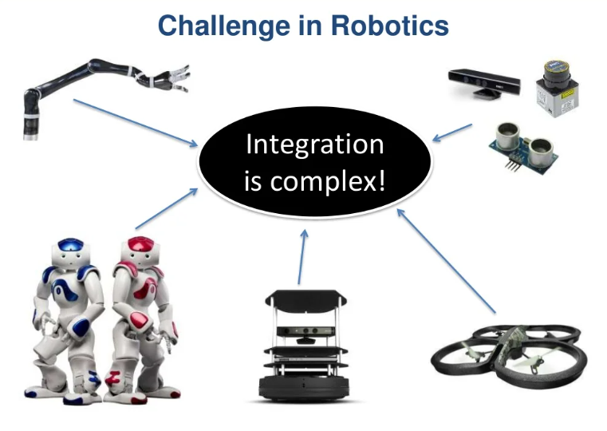

## What is ROS(Robot Operating System)?

ROS(Robot Operating System) is a software framework to enable communication, data flow, and suitable infrastructure development for a hardware-software system (robotics being the best application).

Oh, wait! It is also technically not an operating system. ROS is an OS only in concept because it provides all the services that any other OS does — hardware abstraction, low-level device control, implementationof commonly-used functionality, message-passing between processes, and package management. But, ROS is a framework on top of the OS that allows it to abstract the hardware from the software. This means you can think in terms of software for
all the hardware of the robot.

And that’s good news for you because this implies that you can actually create programs for robots without having to deal with the hardware. Cool right!

## Features of ROS

